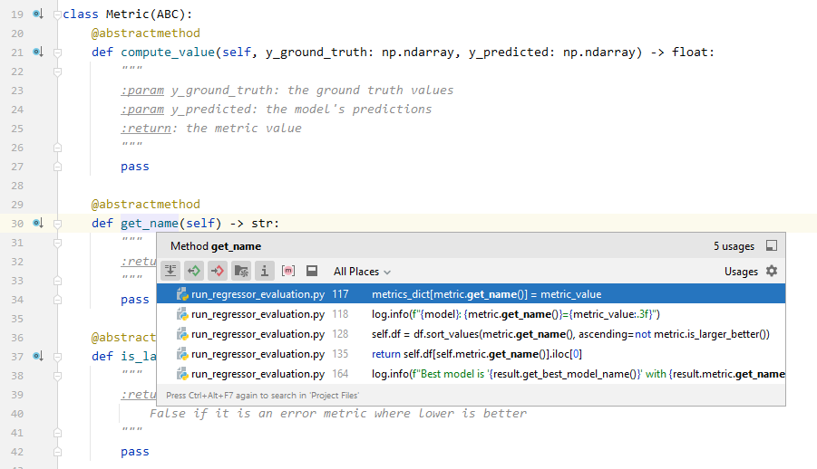
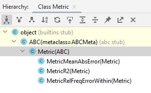
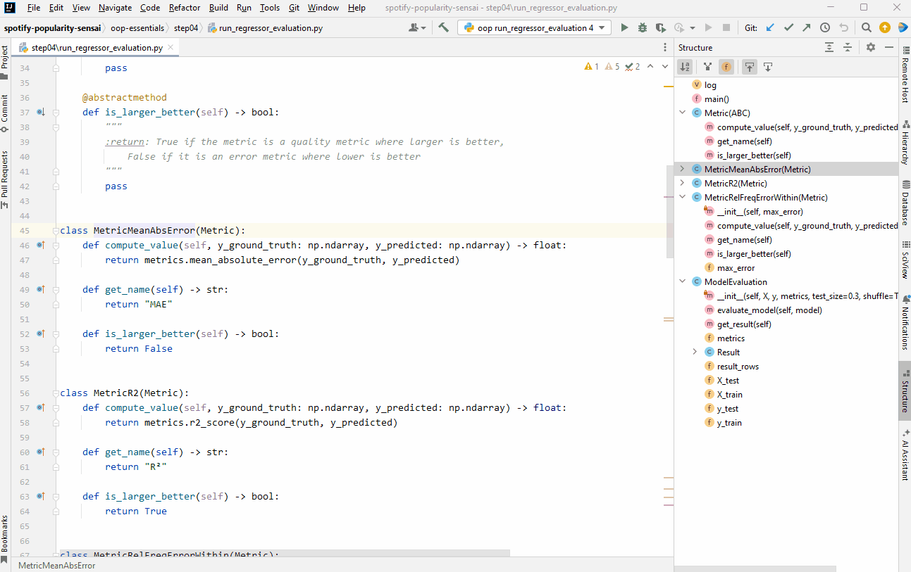
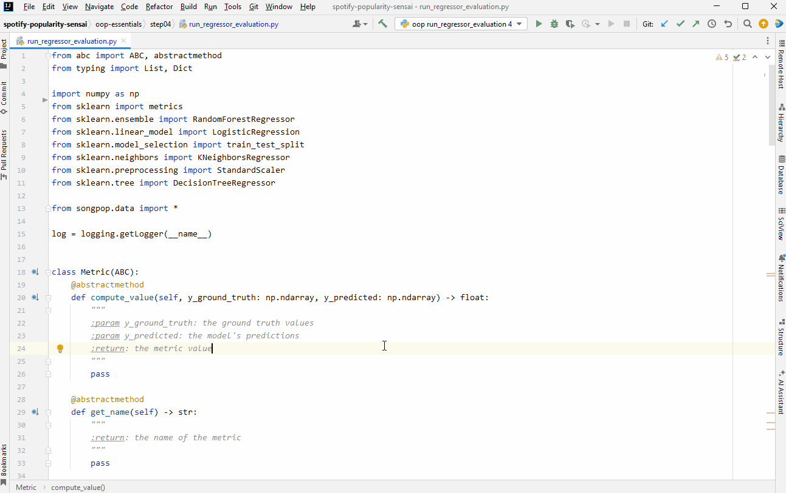
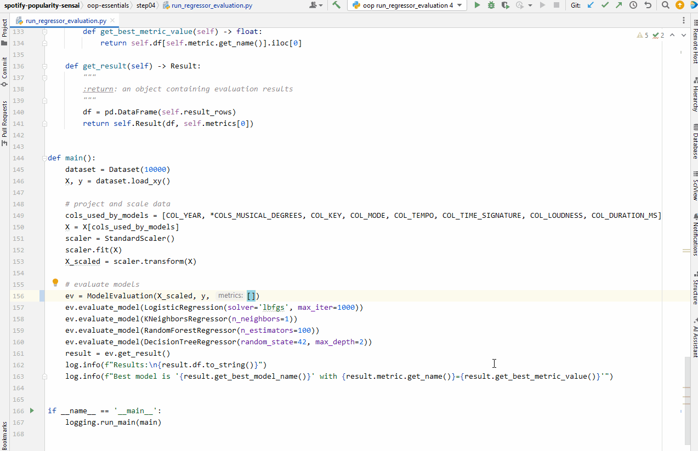
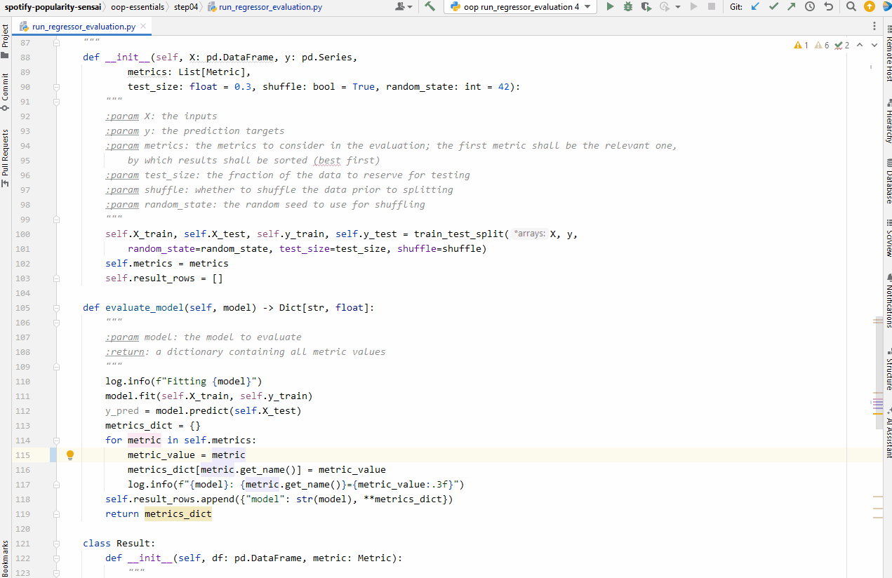
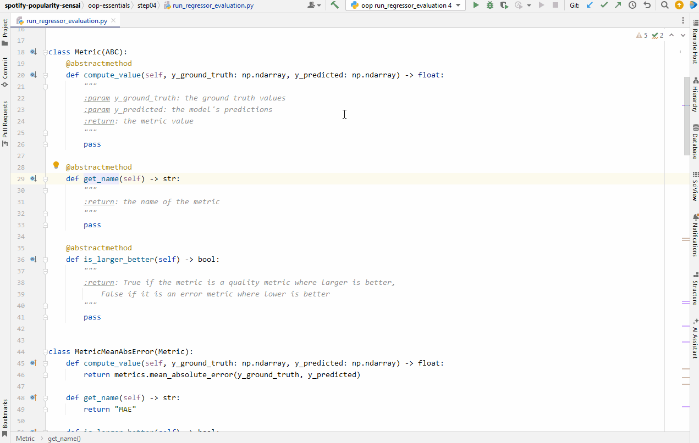
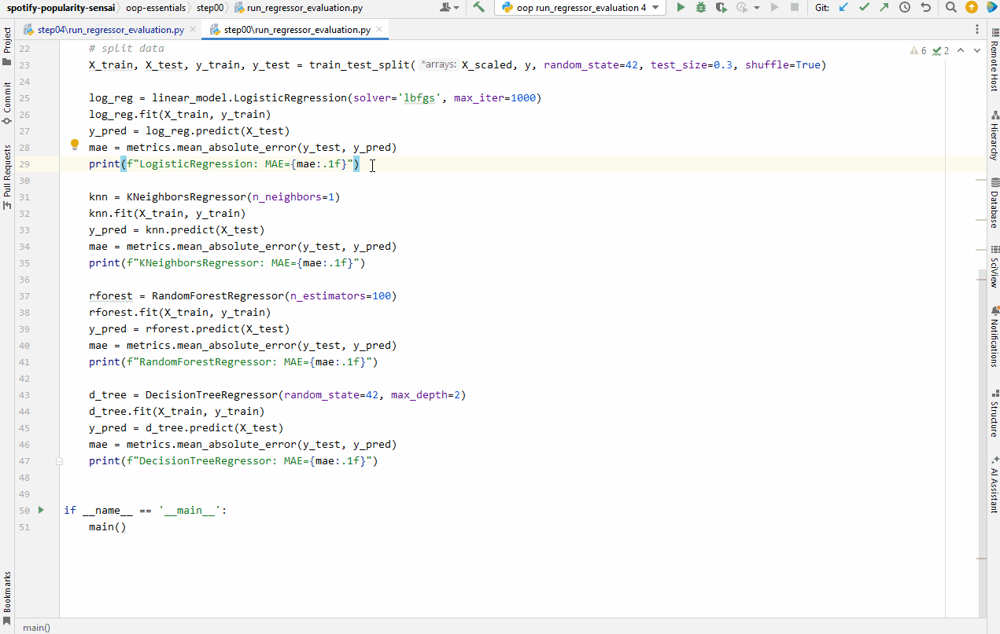

# Making Use of IDE Features

Knowing your integrated development environment (IDE) well and using it to its full potential is essential in speeding up the development process and can greatly reduce the potential for errors.
In the following, we will specifically address Python development using **JetBrains IDEs** (i.e. PyCharm and IntelliJ IDEA) and **Microsoft Visual Studio Code** (aka VSCode).

## Type Annotations

Python is a dynamically typed language, but the addition of type hints can greatly enhance the assistance functions that can be provided.
Especially in larger software projects, it is imperative that all interfaces be type-annotated, as type hints critically support

  * [**usage discovery**](#finding-usages) and, by extension, [**refactoring/renaming**](#renaming)

    If the type of every identifier is known to your IDE, this critically enables the discovery of all places in which a type, function or variable is being used.
    Upon request, the IDE can thus easily display all places in which the respective identifier is being used and can, furthermore, assist in refactoring it (e.g. renaming it or moving it to a different place), updating all references automatically.

  * [**type-based auto-completion**](#type-based-auto-completion)

    With the type of every variable being known, the IDE can display, in particular, the methods that are supported by a particular object and can auto-complete them and furthermore directly provide information on the arguments that are required. This eliminates the need to read external documentation or inspect the source code of the function being called. This greatly increases efficiency.

  * **static type analysis**

    With known types, the IDE (and other static analysis tools) can determine whether the types you are passing to or returning from functions match the expected types and can display errors as you type.

  * **interface documentation**
    
    Types help to document an interface and often completely eliminate the need for further explanations.
    

## Navigating and Understanding the Code

### Finding Usages

Being able to quickly find places where an identifier/function is being used is essential when trying to determine how/whether the respective code is being used.
It can be critical in gaining a deep understanding of how the code works.

| IDE       | Shortcut                                           |
| --------- |----------------------------------------------------|
| JetBrains | Ctrl+B (Cmd+B) or Ctrl+Left-Click (Cmd+Left-Click) |
| VSCode    | Alt+Shift+F12 (Opt+Shift+F12)                      |

### Go to Definition

When an identifier is in front of you, navigating to the code that defines it can be helpful in order to find out more about it.

| IDE       | Shortcut                                           |
| --------- |----------------------------------------------------|
| JetBrains | Ctrl+B (Cmd+B) or Ctrl+Left-Click (Cmd+Left-Click) |
| VSCode    | F12 or Ctrl+Left-Click (Cmd+Left-Click)            |

### Search

Searching the entire code base in your IDE for specific elements allows you to quickly navigate to the respective
pieces of code and thus speeds up your overall workflow.

#### Type Search

Sometimes you know the name of the type/class you are looking for but not its precise location (within the entire project, including dependencies).

| IDE       | Shortcut       |
| --------- |----------------|
| JetBrains | Ctrl+N (Cmd+N) |
| VSCode    | ND           |

#### File Search

Directly searching for filenames can be much faster than looking for a file's location in the project's folder structure.

| IDE       | Shortcut                   |
| --------- |----------------------------|
| JetBrains | Ctrl+Shift+N (Cmd+Shift+N) |
| VSCode    | Ctrl+P (Cmd+P)             |

#### Substring Search

Sometimes we want to search for the occurrences of string literals or code snippets.

| IDE       | Shortcut                           |
| --------- |------------------------------------|
| JetBrains | Ctrl+Shift+F                       |
| VSCode    | Ctrl+Shift+F (Cmd+Shift+F)         |

### Class Hierarchy Display

Displaying the place of a given type we are currently faced with in the hierarchy of classes can be essential in determining its role:
Which classes is it based on and which classes does it inherit from it?

This is the hierarchy of the `Metric` class from the earlier example:

| IDE       | Shortcut  |
| --------- |-----------|
| JetBrains | Ctrl+H    |
| VSCode    | Alt+Shift+H (Opt+Shift+H) |

### Structure/Outline View

The structure/outline view can provide a quick overview of a module's content, and it can also be used to navigate within the file by clicking on its elements.

| IDE       | Shortcut      |
| --------- |---------------|
| JetBrains | Alt+7 (Cmd+7) |
| VSCode    | In Sidebar. Shortcut can be set in Settings |

In JetBrains IDEs, the view can 
  * optionally be sorted lexicographically,
  * be extended to show elements inherited from base classes,
  * be configured to highlight the element corresponding to the current cursor position,
which further enhances the usability (see buttons in top toolbar).

### Structure/Outline-Based Navigation

Especially in larger files, being able to quickly navigate to elements of the module structure by typing in part of the respective name can be very efficient.

| IDE       | Shortcut           |
| --------- |--------------------|
| JetBrains | Ctrl+F12 (Cmd+F12) |
| VSCode    | ND               |

### Forward/Backward Navigation

When jumping between positions in the code (e.g. in conjunction with "go to definition"), it is important to be able to quickly jump back and forth recent cursor/editing positions.

| IDE       | Shortcut                                 |
| --------- |------------------------------------------|
| JetBrains | Ctrl+Alt+Left/Right (Cmd+Opt+Left/Right) |
| VSCode    | Backward Ctrl+"-" (Cmd+"-") Forward Ctrl+Shift+"-" (Cmd+Shift+"-") |

### Recently Used Files

When jumping between files, being able to quickly return to a previous file (without using the mouse to click on a tab) can be very efficient.

| IDE       | Shortcut       |
| --------- |----------------|
| JetBrains | Ctrl+E (Cmd+E) |
| VSCode    | Ctrl+Alt+Left/Right (Cmd+Opt+Left/Right) |

## Editing

### Auto-Completions

Auto-completion helps save time by not requiring the developer to type out the names of identifiers.

#### Identifier Auto-Completion

**Auto-completion of local identifiers** (from the current Python module):

| IDE       | Shortcut  |
| --------- | --------- |
| JetBrains | just start typing or explicitly request via Ctrl+Space |
| VSCode    | just start typing |

**Auto-completion of identifiers in the entire project**, including external dependencies:

| IDE       | Shortcut  |
| --------- | --------- |
| JetBrains | Ctrl+Space+Space |
| VSCode    | just start typing |

Auto-completing an identifier automatically adds the respective import to the module's preamble.

#### Type-Based Auto-Completion

With the types of identifiers being known, the IDE can directly auto-complete the functions and attribute the respective object supports.

| IDE       | Shortcut  |
| --------- | --------- |
| JetBrains | type `.` after the identifier or explicitly request via Ctrl+Space |
| VSCode    | type `.` after the identifier |

### Refactoring

Whenever possible, refactoring operations should always be performed via the IDE's dedicated refactoring functions,
as this will critically ensure that all references are appropriately updated - provided that all references are known through type annotations.

#### Renaming

Your IDE supports you, when you would like to rename a component in your code base. It consistently
adapts usages throughout your codebase.

| IDE       | Shortcut  |
| --------- |-----------|
| JetBrains | Shift+F6  |
| VSCode    | F2      |

#### Moving a Component to Another Module

Whenever you would like to extract components and move them to a different module, the IDE can manage this
automatically, adapting all references to this component.

| IDE       | Shortcut |
| --------- |-----|
| JetBrains | F6  |
| VSCode    | Ctrl+Shifr+R and select "Move Symbol to" |

#### Extracting a Method/Local Variable

Turning a piece of code into a function/method is a common refactoring task:

| IDE       | Shortcut               |
| --------- |------------------------|
| JetBrains | Ctrl+Alt+M (Cmd+Opt+M) |
| VSCode    | Ctrl+Shifr+R and select "Extract Method" |

The reverse operation (inlining a function) is also a common refactoring task.

#### Extracting a Local Variable

Turning an expression into a local variable is another minor refactoring task that frequently comes in handy.
The IDE will typically update all usages of the expression.

| IDE       | Shortcut               |
| --------- |------------------------|
| JetBrains | Ctrl+Alt+V (Cmd+Opt+V) |
| VSCode    | Ctrl+Shifr+R and select "Extract Variable" |

### Basic Editing

**Delete line**

| IDE       | Shortcut                   |
| --------- |----------------------------|
| JetBrains | Ctrl+Y (Cmd+Y)             |
| VSCode    | Ctrl+Shift+K (Cmd+Shift+K) |

**Move line(s) up/down**

| IDE       | Shortcut                              |
| --------- |---------------------------------------|
| JetBrains | Alt+Shift+Up/Down (Opt+Shift+Up/Down) |
| VSCode    | Alt+Up/Down (Opt+Up/Down)             |

**Move cursor to next/previous word**

| IDE       | Shortcut                         |
| --------- |----------------------------------|
| JetBrains | Ctrl+Left/Right (Opt+Left/Right) |
| VSCode    | Alt+Left/Right (Opt+Left/Right) |

**Move to start/end of line/statement**

| IDE       | Shortcut                         |
| --------- |----------------------------------|
| JetBrains | Home/End or Fn+Left/Right        |
| VSCode    | Ctrl+Left/Right (Cmd+Left/Right) |