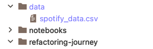

# Predicting Spotify Song Popularity: A Refactoring Journey

In this case study, we will show how a machine learning use case that is implemented
as a Jupyter notebook can be successively refactored to gain flexibility and
adopt software design principles as well as workflow improvements in order
to facilitate experimentation.

The use case considers a [dataset](https://www.kaggle.com/datasets/notshrirang/spotify-million-song-dataset) from kaggle containing meta-data on approximately one million songs.
The goal is to use the data in order to learn a model for the prediction of popularity given other attributes such as the tempo, the release year, the key, the musical mode, etc.

## How to use this package?

This package is organised as follows:
 * There is one folder per step in the refactoring process with a dedicated README file explaining the key aspects of the respective step.
 * There is an independent Python implementation of the use case in each folder, which you should inspect alongside the README file.  

The intended way of exploring this package is to clone the repository and open it in your IDE of choice, 
such that you can browse it with familiar tools and navigate the code efficiently.

### Diffing

To more clearly see the concrete changes from one step to another, you can make use 
of a diff tool. 
To support this, you may run the Python script 
`generate_repository.py` in order to create a git repository in `./refactoring-repo` that references 
the state of each step in a separate tag, i.e. in said folder, you could run, for example,
   
        git difftool step04-refactoring step05-sensai

### Preliminaries

In order for the code of each step to be runnable, set up a Python virtual environment
and download the Spotify song data.

#### Python Environment

Use conda to create an environment based on [environment.yml](../environment.yml) in the root folder of this repository:

    conda env create -f ../environment.yml

This will create a conda environment named `pop`.

#### Configure Your IDE's Runtime Environment

Configure your IDE to use the `pop` environment created in the previous step.
Furthermore, make sure to add the folder `../src` to your PYTHONPATH (in PyCharm, simply 
mark the folder as a sources root).

#### Downloading the Data

You can use the script [load_data.py](../scripts/load_data.py) to automatically download the raw data CSV file to the subfolder
`data` on the top level of the repository. 
Note that a Kaggle API key is required for this (see [instructions](https://www.kaggle.com/docs/api)).

Alternatively, you can [download the dataset manually from the Kaggle website](https://www.kaggle.com/datasets/notshrirang/spotify-million-song-dataset).
Place the CSV file `spotify_data.csv` in the `data` folder (in the root of this repository).

## Steps in the Journey

These are the steps of the journey:

 0. [Monolithic Notebook](step00-monolithic-notebook/README.md)
   
    This is the starting point, a Jupyter notebook which is largely unstructured.  
   
 1. [Python Script](step01-python-script/README.md)

    This step extracts the code that is strictly concerned with the training and evaluation of models.

 2. [Dataset Representation](step02-dataset-representation/README.md)

    This step introduces an explicit representation for the dataset, making transformations explicit as well as optional.

 3. [Model-Specific Pipelines](step03-model-specific-pipelines/README.md)

    This step refactors the pipeline to move all transforming operations into the models, enabling different models to use entirely different pipelines.

 4. [Refactoring](step04-refactoring/README.md)

    This step improves the code structure by adding function-specific Python modules.

 5. [sensAI](step05-sensai/README.md)

    This step introduces the high-level library sensAI, which will enable more flexible, declarative model specifications down the line.
    It furthermore facilitates logging, model evaluation and helps with other minor details.

 6. [Feature Representation](step06-feature-representation/README.md)

    This step separates representations of features and their properties from the models that use them, allowing
    model input pipelines to be flexibly composed.

 7. [Feature Engineering](step07-feature-engineering/README.md)

    This step adds an engineered feature to the mix.

 8. [Tracking Experiments](step08-tracking-experiments/README.md)

    This step adds tracking functionality via sensAI's mlflow integration and by logging directly to the file system.

 9. [Regression](step09-regression/README.md)

    This step considers the perhaps more natural formulation of the prediction problem as a regression problem.

10. [Cross-Validation](step10-cross-validation/README.md)

    This step adds the option to use cross-validation.

11. [Deployment](step11-deployment/README.md)

    This step adds a web service for inference, which is packaged in a docker container.

