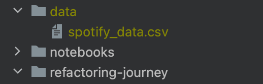

# Predicting Spotify Song Popularity: A Refactoring Journey

In this case study, we will show how a machine learning use case that is implemented
as a Jupyter notebook can be successively refactored to gain flexibility and
adopt software design principles as well as workflow improvements in order
to facilitate experimentation.

The use case considers a [dataset](https://www.kaggle.com/datasets/notshrirang/spotify-million-song-dataset) from kaggle containing meta-data on approximately one million songs.
The goal is to use the data in order to learn a model for the prediction of popularity given other attributes such as the tempo, the release year, the key, the musical mode, etc.

## Package Organisation

This package is organised as follows:
 * There is one folder per step in the refactoring process with a dedicated README file explaining the key aspects of the respective step.
 * There is an independent Python implementation of the use case in each folder, which you should inspect alongside the README file.  
   
**Diffing**. For most steps, it can also make sense to use a diff tool to view precisely what has changed. To support this, you may run the Python script 
`generate_repository.py` in order to create a git repository in `./refactoring-repo` that references the state of step in separate tags, i.e. in said folder, you could run, for example,
   
        git difftool step04-refactoring step05-sensai

For your exploring of the journey, you can create a conda environment from [environment.yml](../environment.yml), which
contains all needed dependencies.

## Data Loading
You can use the script [load_data.py](load_data.py) to automatically load the raw data csv-file to the subfolder
'data' on the top-level of the repository. Be aware, that you have to generate a Kaggle API key for this, see the following 
[instructions](https://www.kaggle.com/docs/api).

If you want to download the [dataset](https://www.kaggle.com/datasets/notshrirang/spotify-million-song-dataset) manually,
place the csv-file as `spotify_data.csv` in the subfolder 'data'.

## Steps in the Journey

These are the steps of the journey:

0. [Monolithic Notebook](step00-monolithic-notebook/README.md)
   
   This is the starting point, a Jupyter notebook which is largely unstructured.  
   
1. [Python Script](step01-python-script/README.md)

   This step extracts the code that is strictly concerned with the training and evaluation of models.

2. [Dataset Representation](step02-dataset-representation/README.md)

   This step introduces an explicit representation for the dataset, making transformations explicit as well as optional.

3. [Model-Specific Pipelines](step03-model-specific-pipelines/README.md)

   This step refactors the pipeline to move all transforming operations into the models, enabling different models to use entirely different pipelines.

4. [Refactoring](step04-refactoring/README.md)

   This step improves the code structure by adding function-specific Python modules.

5. [sensAI](step05-sensai/README.md)

   This step introduces the library sensAI, which will enable more flexible model specifications down the line.
   It furthermore facilitates logging and helps with other minor details.

6. [Feature Representation](step06-feature-representation/README.md)

   This step separates representations of features and their properties from the models that use them, allowing
   model input pipelines to be flexibly composed.

7. [Feature Engineering](step07-feature-engineering/README.md)

   This step adds an engineered feature to the mix.

8. [Tracking Experiments](step08-tracking-experiments/README.md)

   This step adds tracking functionality via sensAI's mlflow integration and by logging directly to the file system.

9. [Regression](step09-regression/README.md)

   This step considers the perhaps more natural formulation of the prediction problem as a regression problem.