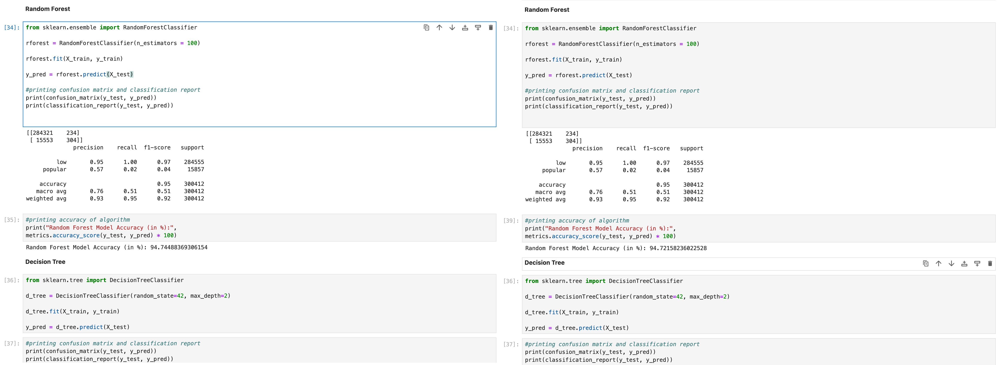

# Step 0: A Monolithic Notebook

The scenario is the following: 
You are working on a new machine learning task and start to investigate your data set. 
Specifically, the task is to build a model that can predict the popularity of a song
from the attributes of the song.
For the data analysis phase, a Jupyter notebook is certainly a good tool, 
as it allows us to store the analysis results (such as plots and tables) in conjunction 
with the code that produced it and thus represents a self-contained artifact
for the analysis that we can go back to in order to make informed modelling decisions
later in the project.

## Problems

It may, at first, be tempting to continue to use Jupyter when starting to define and evaluate 
machine learning models. 
Unfortunately, this way of working would severely limit our ability to experiment rapidly whilst
keeping track of past results and maintaining a setup that enables us to simultaneously support
old and new implementations alike.

Let's assume that we start with the [Jupyter notebook in this folder](spotify-song-popularity-prediction.ipynb).
Here are a few limitations, all of which we shall address in our refactoring journey:

* **The current paradigm is not amenable to experimentation**, as it does not facilitate the execution
  of experiments where parts of the implementation vary in some shape or form.

  * If we experimented with different variations of the models by
    changing the existing code, we obviously lose the old implementation and have no
    way to compare the old solution to the new one in later experiments (e.g. on different data).
  * If we experimented with different variations of the models by 
    adding new code of the same nature, this would result in severe code duplication.

  In essence, we need a way of parametrising our code rather than changing it, and the way
  to achieve this is through abstractions.

* **The current implementation is inflexiblie both with respect to the data and with 
  respect to the models**.

  * There is no clearly defined data set (and no respective representation or abstraction).
    Therefore, experiments with variations of the data set cannot easily be supported.
  * Data filtering/preprocessing is inextricably linked with model-specific input transformation, 
    yet it may be highly desirably to change the input representation (and even the set of inputs entirely) for different models.
  * There is no separation between the features being used and their model-specific representations.
    Global data preprocessing is inextricably linked with model input preparation.
      * We can easily use only one set of features for all models.
      * The feature representation is the same across all models (and therefore is the least common denominator); model-specific capabilities cannot be exploited.
        Specifically, in our example, categorical features are either not being used or being
        represented in a rather questionable manner.

* **Results cannot conveniently be tracked** for future reference. They are stored only in the cells'
  outputs.
    * If we created variations of our experiments by changing existing parts of the notebook, 
      we would lose earlier results. 
      And if we kept extending the notebook, we would, owing to the entirely procedural semantics, 
      end up with an overly lengthy implementation would eventually become unmanageable.
    * We cannot easily support multiple experiments, i.e. variations where we change the premise of
      the prediction or the data set, as there is no notion of an *experiment representation* with which we could associate results.
    * There is no good way of archiving our results. Git would not really be a good option; if we stored the notebook with the cell outputs, new executions would produce unnecessarily large diffs.

* **The resulting models are not self-contained artifacts** that could be deployed for inference.
  Even if, in the inference case, we had the exact same features available, there is no object in our
  current implementation that would transform these inputs to the desired predictions.

* The notebook programming style encourages mistakes, as the workflow often involves reusing
  past results and the re-execution of individual cells. 
  This can result in states where a re-execution of the full notebook no longer produces the same 
  result as the one that was produced by the series of cell executions performed by the programmer.

  Here's an example: There are three different models defined in the notebook. 
  To evaluate the models, an accuracy score is computed on some test data. 
  In each case, the variable name of the outcomes is `y_pred`, so the state of the
  variable depends on the execution order of the cells in the notebook. 
  This can lead to behaviour as shown here (notice the output indices in the variant on the right),

  

  where a re-computation of the accuracy score of the random forest model after having evaluating the decision tree leads to an incorrect output in terms of what is actually printed.
