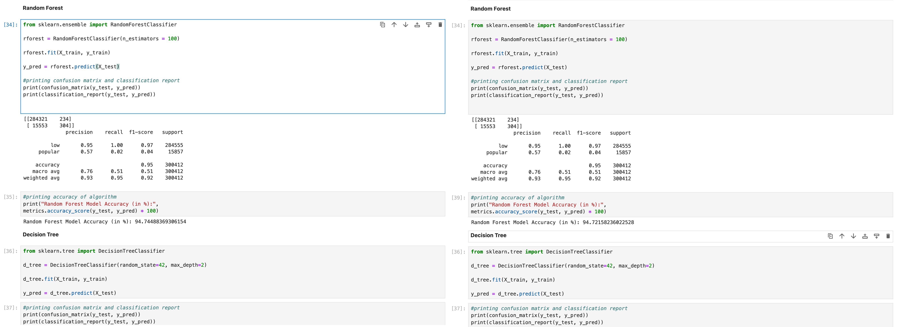

# Step 0: One Notebook to rule them all

The scenario is the following, you are working on a new machine learning and start to investigate your
data set. This exploratory data exploration phase often includes plotting the distribution of several variables.

## Problems

Since Jupyter is a convenient way to visualize these plots, it is tempting to just continue using jupyter
when start defining and training machine learning models. Nevertheless, we find some problematic issues 
in our example notebook.

* The code uses no abstractions, all semantics are purely procedural
* There is no clearly defined data set (and no respective representation) -> step02
    * Experiments with variations of the dataset are poorly supported.
    * No possibility to down-sample the data for quick development.
* Data filtering/preprocessing and model-specific input transformation are inextricably linked -> step03
* No separation between the features being used and their model-specific representations -> step06
    * We can easily use only one set of features.
    * The feature representation is the same across all models (and therefore is the least common denominator).
      In our example, this means no usage of categorical features, at all.
* No reusable components, largely unstructured code -> step04 (and most others)
* Randomness is partly uncontrolled (no reproducibility) -> step05
* The resulting models are not self-contained artifacts that could be deployed for inference -> step03
* All results that are produced are only temporarily stored only within the notebook's cell outputs. 
    * If we create variations of the experiment by changing the notebook, we lose earlier results.
    * If we create variations by appending to the notebook, we would need to duplicate large portions of the code
      (as no abstractions exist that could be reused).
* Using a notebook is not playing well together with git, since 
  every execution of the notebook results in a new diff. -> step01

### State dependency on execution order

A big drawback is the fact, that the state of the jupyter notebook depends on the execution order of the cells.
In our example, there are three different models defined in the notebook. To evaluate the models, an accuracy
score is computed on some test data. The variable name of the outcomes is in all cases `y_pred`, so the state of the
variable is depending on the execution order of the cells in the notebook. This can lead to
malign behavior, e.g.



i.e. re-computing the accuracy score of the random forest model after evaluating the decision tree
leads to a 'wrong' (in the sense the print message suggesting) output. Here the problem could have been resolved by
using different variables, but you can imagine, that there are scenarios, which are more subtle.

### Code duplication

We find the following closely related to the state issue. The code snippet
```
print(confusion_matrix(y_test, y_pred))
print(classification_report(y_test, y_pred))
```
is copied and pasted for every model. Without re-using the variable `y_pred`, a copy&paste procedure
would not work. For consistent modification of the evaluation result plotting, you would have to modify
every code passage the same way. Clearly this does not scale and is prone to introducing errors.


