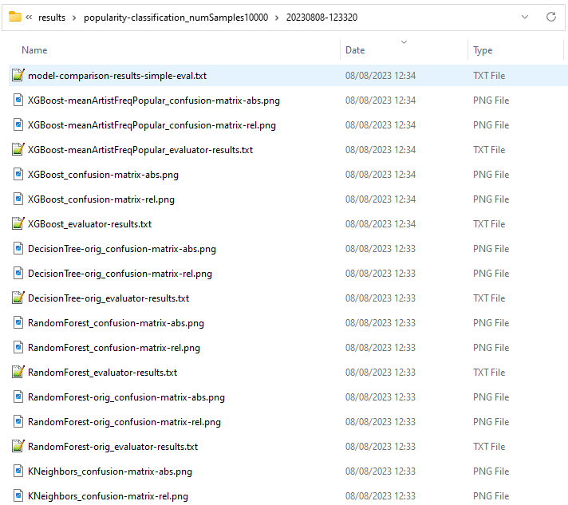
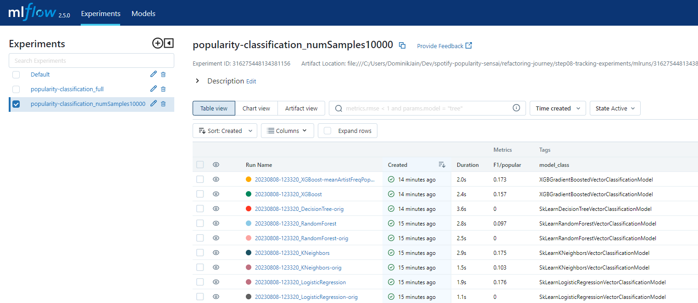

# Step 8: Tracking Experiments

In this step, we introduce tracking mechanisms for our experiments.
sensAI has integrated support for mlflow via the `MLFlowTrackedExperiment`
implementation.
It furthermore supports direct logging to the file system via its `ResultWriter` 
class.
We have (redundantly) added both options to our [main script](run_classifier_evaluation.py) as follows:

```python
    # set up (dual) tracking
    experiment_name = f"popularity-classification_{dataset.tag()}"
    run_id = datetime_tag()
    tracked_experiment = MLFlowExperiment(experiment_name, tracking_uri="", context_prefix=run_id + "_",
        add_log_to_all_contexts=True)
    result_writer = ResultWriter(os.path.join("results", experiment_name, run_id))
    logging.add_file_logger(result_writer.path("log.txt"))

    ...

    ev.compare_models(models, tracked_experiment=tracked_experiment, result_writer=result_writer)
```

To ensure that the dependency of results on the data set is appropriately 
considered, we attach to the experiment name a compact tag that contains
the relevant data set parameters, using a `TagBuilder` to conveniently 
construct it without being overly verbose.

At the mlflow level, we differentiate two concepts:
  * An *experiment*, which is a container for results that are intended to be
    comparable, i.e. in our case, it is determined by the specific prediction
    task and the data set that is being used.
    For example, if we configure the data set to use 10000 samples with 
    non-default random seed 23, the data set tag will be `numSamples10000-seed23`.
  * A *run*, which holds individual results specific to a particular model. 
    In sensAI terms, this is called the *tracking context*. 
    As an identifier for a model, we use a tag derived from the current date
    and time in combination with the model name (which should be unique across
    several executions of our script). 
    For example, the resulting run name could be
    `20230808-114244_LogisticRegression`.

Running the main script will now
  * save model descriptions, metrics, images (showing confusion matrices) 
    and logs to the folder specified in the `ResultWriter`.

    

  * save the same meta-data, metrics, logs and images to the local mlflow data store (serverless, since we did not specify a URI).
    We can start a server to conveniently inspect the results in a web 
    interface by running `mlflow ui`. Here's a screenshot:
    
    

By tracking results specific to a concrete experimental setup across an arbitrary
number of executions of our script, we never lose track of the performance 
we achieved in the past.
**We are now free to experiment** with different parametrisations of our existing
models (as well as entirely new models) - simply by changing the list of models
we consider in the main script.
At all times, we can conveniently inspect the results and sorted them by performance. 
If need be, we can easily inspect all the hyperparameters and look at the detailed
logs of the individual runs.
