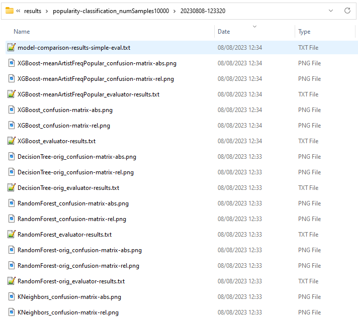

# Step 8: Tracking Experiments

In this step, we introduce tracking mechanisms for our experiments.
sensAI has integrated support for mlflow via the `MLFlowTrackedExperiment`
implementation.
It furthermore supports direct logging to the file system via its `ResultWriter` 
class.
We have (redundantly) added both options to our [main script](run_classifier_evaluation.py) as follows:

```python
    # set up (dual) tracking
    experiment_name = f"popularity-classification_{dataset.tag()}"
    run_id = datetime_tag()
    tracked_experiment = MLFlowExperiment(experiment_name, tracking_uri="", context_prefix=run_id + "_",
        add_log_to_all_contexts=True)
    result_writer = ResultWriter(os.path.join("results", experiment_name, run_id))
    logging.add_file_logger(result_writer.path("log.txt"))

    ...

    ev.compare_models(models, tracked_experiment=tracked_experiment, result_writer=result_writer)
```

To ensure that the dependency of results on the data set is appropriately 
considered, we attach to the experiment name a compact tag that contains
the relevant data set parameters, using a `TagBuilder` to conveniently 
construct it without being overly verbose.

At the mlflow level, we differentiate two concepts:
  * An *experiment*, which is a container for results that are intended to be
    comparable, i.e. in our case, it is determined by the specific prediction
    task and the data set that is being used.
    For example, if we configure the data set to use 10000 samples with 
    non-default random seed 23, the data set tag will be `numSamples10000-seed23`.
  * A *run*, which holds individual results specific to a particular model. 
    In sensAI terms, this is called the *tracking context*. 
    As an identifier for a model, we use a tag derived from the current date
    and time in combination with the model name (which should be unique across
    several executions of our script). 
    For example, the resulting run name could be
    `20230808-114244_LogisticRegression`.

Running the main script will now
  * save model descriptions, metrics, images (showing confusion matrices) 
    and logs to the folder specified in the `ResultWriter`.

    

  * save the same meta-data, metrics, logs and images to the local mlflow data store (serverless, since we did not specify a URI).
    We can start a server to conveniently inspect the results in a web 
    interface by running `mlflow ui`. Here's a screenshot:
    
    

By tracking results specific to a concrete experimental setup across an arbitrary
number of executions of our script, we never lose track of the performance 
we achieved in the past.
**We are now free to experiment** with different parametrisations of our existing
models (as well as entirely new models) - simply by changing the list of models
we consider in the main script.
At all times, we can conveniently inspect the results and sort them by performance. 
If need be, we can easily inspect all the hyperparameters and look at the detailed
logs of the individual runs.

## Leveraging Our New-Found Freedom to Experiment

To illustrate the freedom we gained, let us experiment with some variations of 
the XGBoost model.
Specifically, 
 * let us evaluate the impact of adjusting a parameter that controls overfitting.
   In a variant of the model, we set the parameter `min_child_weight` to a higher
   value, thus establishing a lower bound for the sample subsets that are allowed
   to end up in any child - and, by extension, any leaf of the tree.
 * let us conduct an experiment to quantify the importance of the mean artist 
   popularity feature that we introduced in the previous step. How good is a 
   model that uses only this feature?

To achieve this, we adapt the XGBoost model factory function to support parametrisation,

```python
    @classmethod
    def create_xgb(cls, name_suffix="", features: Sequence[FeatureName] = DEFAULT_FEATURES, add_features: Sequence[FeatureName] = (),
            min_child_weight: Optional[float] = None, **kwargs):
        fc = FeatureCollector(*features, *add_features, registry=registry)
        return XGBGradientBoostedVectorClassificationModel(min_child_weight=min_child_weight, **kwargs) \
            .with_feature_collector(fc) \
            .with_feature_transformers(fc.create_feature_transformer_one_hot_encoder()) \
            .with_name(f"XGBoost{name_suffix}")
```

such that we can easily vary the set of features and adjust the model parameters.
As outlined above, we then include the following XGBoost models in the list of evaluated models:

```python
        ModelFactory.create_xgb(),
        ModelFactory.create_xgb("-meanArtistFreqPopular", add_features=[FeatureName.MEAN_ARTIST_FREQ_POPULAR]),
        ModelFactory.create_xgb("-meanArtistFreqPopularOnly", features=[FeatureName.MEAN_ARTIST_FREQ_POPULAR]),
```

In addition to the base model "XGBoost", which uses the previously defined default features and parameters,
we now additionally define three variants thereof:
 * `XGBoost-meanArtistFreqPopular` adds the mean artist popularity on top of the default features
 * `XGBoost-meanArtistFreqPopularOnly` reduces the feature set to the single defined feature.

Notice that we were able to very concisely define the model variants, without any code duplication.
The models adapt dynamically to the properties we specify!

We now want to compute meaningful results, and therefore we switch to the full dataset.
The random forest models are prohibitively slow to train, and we thus disabled them.
For the variations of the XGBoost model, we obtain: 
```
INFO  2024-01-24 14:32:08,271 sensai.evaluation.eval_util:compare_models - Model comparison results:
                                   accuracy  balancedAccuracy  precision[popular]  recall[popular]  F1[popular]
model_name
XGBoost                            0.962409          0.645840            0.710075         0.297486     0.419305
XGBoost-meanArtistFreqPopular      0.964426          0.689429            0.698998         0.386820     0.498033
XGBoost-meanArtistFreqPopularOnly  0.957034          0.637985            0.556452         0.286902     0.378601
```

Therefore, we can conclude that 
  * the mean artist popularity feature is hugely important; adding it to the model increases the F1 score 
    significantly.
  * removing all other features deteriorated the results, but the F1 score of the model that uses only the 
    popularity feature is still remarkably high.
    

## Principles Addressed in this Step

* Track experiments
